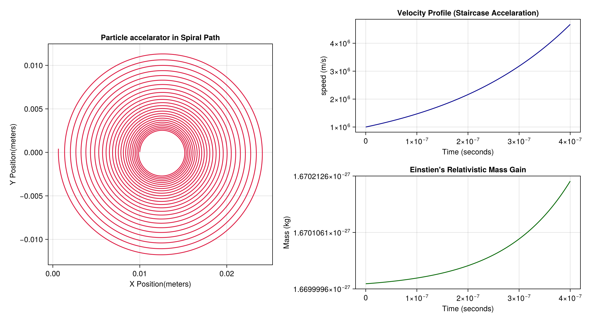

##--RELATIVISTIC CYCLOTRON SIMULATOR--##

Welcome to my project! I build this to model and visualize the complex physics behind the particle acceleration
in Cyclotron in the presence of the Magnetic Field(B) and the Voltage gap (V_gap). 

#Reason to build this simulation 
As part of my Physics and Computational Studies, I wanted to see how relativistic effects alter the classical mechanics in Real-Time.

## Core Physics I Modeled 
-- Einstien's Relativistic Mass Dilation: using the formula [ m = m0 / sqrt(1 - (v^2 / c^2)) ] to recalculate 
  the particle's mass as respect to its increasing velocity at ever time step of [5 x 10^-11]--#assumed time interval.
  
--Lorentz force & Orbit Radii: My code updates the spiral radius as the momentum changes, causing the 
  path density to alter as velocity climbs.
  
--Voltage Gap Transitions: I simulated an current electric field that accelerates the  proton precisely as it crosses the central gap.

## Features & Visualization 
I used "Julia" alongside "CairoMakie" to design a multi-panel layout dashboard that outputs:
1. "The Trajectory Plot": A high-clarity visualization to show th expanding spiral path.
2. "The Speed Profile": A curve mapping showing how high a particle gets to the speed of light.
3. "Dynamic Mass Tracking": a graph showing the exponential curve of the mass dilation.

## My Tech stack
- LANGUAGE: "Julia"
- Libraries Used: CairoMakie, LinearAlgebra

----
feel free to explore the code in 'Learn.jl'. 
If you have any feedback or ideas on improving the simulation accuracy, Let me know!.
